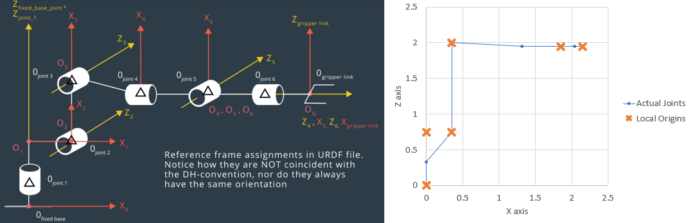
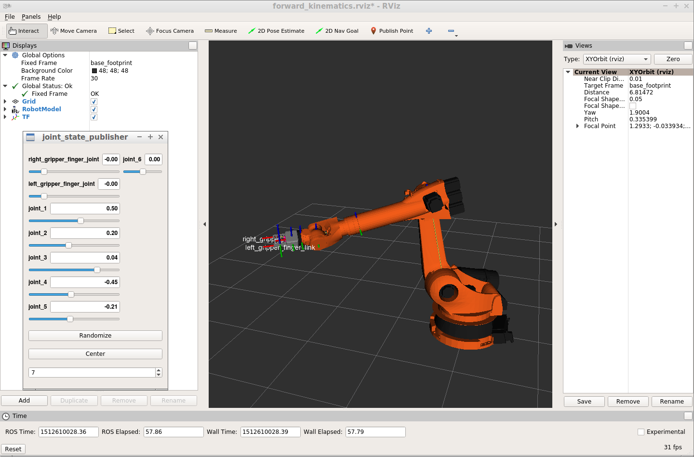
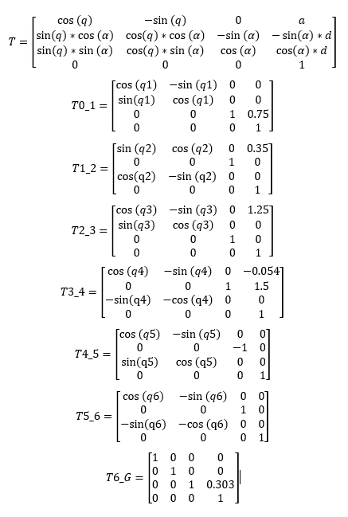

## Project: Kinematics Pick & Place

The present project illustrates my solution to the [Udacity Pick and Place project for RoboND](https://github.com/udacity/RoboND-Kinematics-Project).

**Steps to complete the project:**  

1. Set up your ROS Workspace.
2. Download or clone the [project repository](https://github.com/udacity/RoboND-Kinematics-Project) into the ***src*** directory of your ROS Workspace.  
3. Experiment with the forward_kinematics environment and get familiar with the robot.
4. Launch in [demo mode](https://classroom.udacity.com/nanodegrees/nd209/parts/7b2fd2d7-e181-401e-977a-6158c77bf816/modules/8855de3f-2897-46c3-a805-628b5ecf045b/lessons/91d017b1-4493-4522-ad52-04a74a01094c/concepts/ae64bb91-e8c4-44c9-adbe-798e8f688193).
5. Perform Kinematic Analysis for the robot following the [project rubric](https://review.udacity.com/#!/rubrics/972/view).
6. Fill in the `IK_server.py` with your Inverse Kinematics code. 

## [Rubric](https://review.udacity.com/#!/rubrics/972/view) Points
### Here I will consider the rubric points individually and describe how I addressed each point in my implementation.  

---
### Writeup / README

#### 1. Provide a Writeup / README that includes all the rubric points and how you addressed each one.  You can submit your writeup as markdown or pdf.  

You're reading it!

### Kinematic Analysis
#### 1. Run the forward_kinematics demo and evaluate the kr210.urdf.xacro file to perform kinematic analysis of Kuka KR210 robot and derive its DH parameters.

Using the urdf file, we can plot the position of each joint.

We can then use the coordinates of the joints to derive DH parameters.

Links | alpha(i-1) | a(i-1) | d(i-1) | theta(i)
--- | --- | --- | --- | ---
0->1 | 0 | 0 | 0.75 | qi
1->2 | - pi/2 | 0.35 | 0 | -pi/2 + q2
2->3 | 0 | 1.25 | 0 | q3
3->4 | -pi/2 | -0.054 | 1.5 | q4
4->5 | pi/2 | 0 | 0 | q5
5->6 | -pi/2 | 0 | 0 | q6
6->EE | 0 | 0 | 0.303 | 0

We verify our values are correct by running the forward_kinematics demo.

#### 2. Using the DH parameter table you derived earlier, create individual transformation matrices about each joint. In addition, also generate a generalized homogeneous transform between base_link and gripper_link using only end-effector(gripper) pose.

The individual transformation matrices are easily derived from the DH parameters by replacing them in the general DH transformation matrix:

We obtain the full transformation from fixed base to gripper by multplying all the individual matrices together: T0_EE = T0_1 * T1_2 * T2_3 * T3_4 * T4_5 * T5_6 * T6_EE.

#### 3. Decouple Inverse Kinematics problem into Inverse Position Kinematics and inverse Orientation Kinematics; doing so derive the equations to calculate all individual joint angles.

We use trigonometry to find the angles on all different joints. We split the problem into 2:
- Position from the base frame to the wrist center
- Position from the wrist center to the end effector

We use the following steps:
- find rotation matrix for end effector through its orientation
- find position of wrist center through previous rotation matrix and position of end effector
- use trigonometry to find the 3 first joint angles, leading to wrist center
- calculate transformation matrix from wrist center to end effector by using the inverse of transformation from the base frame to the wrist
- use trigonometry to find the last 3 joint angles

### Project Implementation

#### 1. Fill in the `IK_server.py` file with properly commented python code for calculating Inverse Kinematics based on previously performed Kinematic Analysis. Your code must guide the robot to successfully complete 8/10 pick and place cycles. Briefly discuss the code you implemented and your results. 

The code has been commented to explain the sequence of steps used. We follow the same logic described previously. Using the sympy library helps visualize the equations and see possible ways to find the angles of the joints. It also let us confirm which variable should be constant, helping a lot in debugging.

The code succeeds in picking correctly the objects, though the trajectory can sometimes seem complex and long.